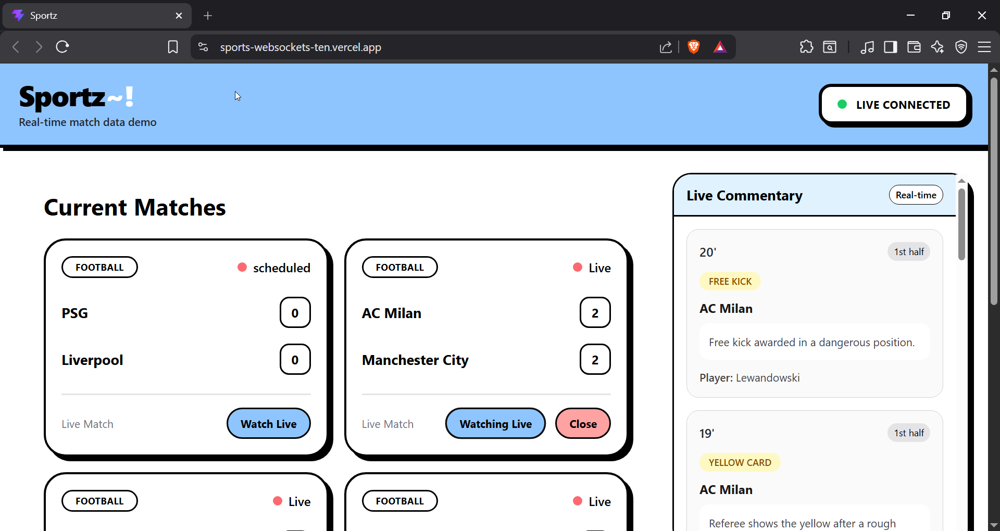
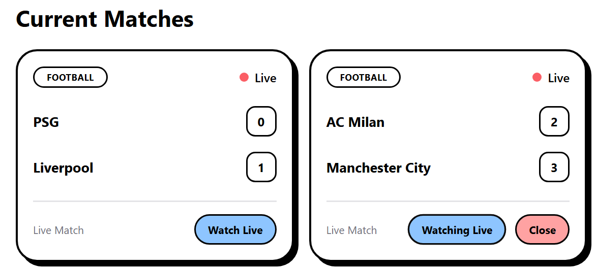
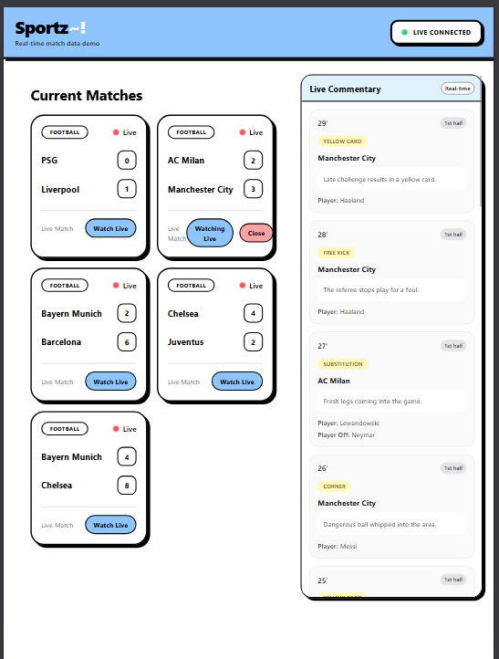
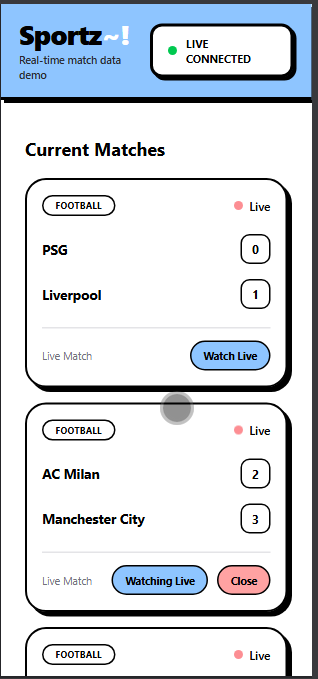

# ⚽ Sportz~! – Real-Time Sports Live Broadcast

> A full-stack real-time sports broadcasting platform built with **React**, **TypeScript**, **Express.js**, **WebSockets**, **Drizzle ORM**, and **Neon PostgreSQL**.

Users can follow live matches, subscribe to individual games, and receive real-time score updates and commentary without refreshing the page.
Using raw websocket api for maximum performance.
---

# 🎥 Live Demo

🌍 **Frontend:** https://sports-websockets-ten.vercel.app

⚙️ **Backend:** https://sports-websockets.onrender.com

---

# 🎬 Project Demo

---

# ✨ Features

* ⚡ Real-time match score updates using WebSockets
* 📝 Live commentary generation
* 👀 Subscribe to individual matches
* 🔕 Unsubscribe from live commentary
* 🎯 Receive updates only for the selected match
* 🏆 Automatic match generation
* 🗑 Automatic removal of finished matches
* 📱 Fully responsive design
* ☁️ Deployed with Render, Vercel, and Neon

---

# 📸 Screenshots

## Home Page

Complete overview of all live matches.

---

## Match Card

Displays real-time scores and live match controls.

---

## Tablet View


Responsive layout optimized for tablets.

---

## Mobile View


Fully responsive mobile experience.

---

# 🏗 Tech Stack

## Frontend

* React
* TypeScript
* Tailwind CSS
* Axios
* WebSocket API

## Backend

* Node.js
* Express.js
* WebSocket (`ws`)
* Drizzle ORM
* Neon PostgreSQL
* Zod
* Arcjet

## Deployment

* Vercel
* Render
* Neon Database

---
## 📂 Project Structure

```text
sports-websockets/
│
├── frontend/                  # React + TypeScript client
│   ├── public/
│   ├── src/
│   │   ├── assets/            # Images and static assets
│   │   ├── components/        # Reusable UI components
│   │   ├── pages/             # Application pages
│   │   ├── services/          # API & WebSocket services
│   │   ├── types/             # TypeScript interfaces/types
│   │   ├── App.tsx
│   │   ├── main.tsx
│   │   └── index.css
│   ├── package.json
│   ├── vite.config.ts
│   └── index.html
│
├── screenshots/               # README screenshots & GIFs
│
├── src/                       # Backend source
│   ├── db/                    # Drizzle database configuration
│   ├── routes/                # Express API routes
│   ├── services/              # Match & commentary generation
│   ├── ws/                    # WebSocket server
│   ├── server.js              # Application entry point
│   └── arcjet.js              # Security configuration
│
├── drizzle/                   # Database migrations
├── apminsightdata/            # Monitoring & logs
├── package.json
├── drizzle.config.js
└── README.md
```

# 🏛 Architecture

```text
               React Frontend
                      │
        HTTP + WebSocket
                      │
              Express Backend
               │            │
               │            │
        PostgreSQL      WebSocket
          (Neon)         Server
```

---

# 🚀 Installation

```bash
git clone https://github.com/FixedAman/sports-websockets.git

cd sports-websockets

npm install
```

### Frontend

```bash
cd frontend

npm install

npm run dev
```

### Backend

```bash
npm run dev
```

---

# 🌐 WebSocket Events

## Client → Server

| Event       | Description                |
| ----------- | -------------------------- |
| subscribe   | Start receiving commentary |
| unsubscribe | Stop receiving commentary  |

---

## Server → Client

| Event          | Description                   |
| -------------- | ----------------------------- |
| match_created  | Broadcast newly created match |
| match_update   | Live score update             |
| commentary     | Live commentary event         |
| match_finished | Remove finished match         |

---

# 💡 Challenges Solved

* Built a real-time communication system using WebSockets.
* Managed subscriptions for individual matches.
* Prevented duplicate WebSocket connections.
* Automatically created and removed matches without page refreshes.
* Synchronized frontend state with backend events.
* Deployed a full-stack application using Vercel, Render, and Neon.

---

# 🔮 Future Improvements

* User authentication
* Favorite teams
* Match history
* Push notifications
* AI-powered commentary enhancements
* Live statistics dashboard
* Can chat all users connected with same match chat
---

# 👨‍💻 Author

**Aman Mahish**

GitHub: https://github.com/FixedAman

#
